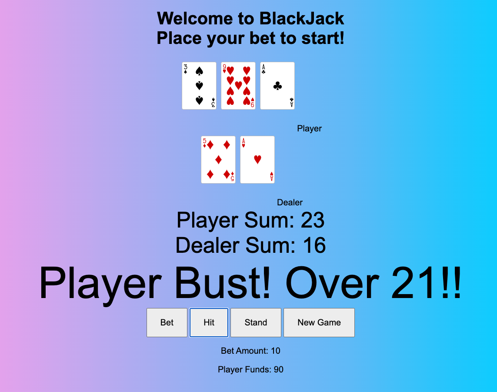

Hi YA!
Welcome to BackJack! 

This is the game of BlackJack.
Player will be playing against the dealer. The goal of this game is to score higher than the dealer without busting (going over 21). Player will start with 100 in funds and each round will cost 10 to begin. Dealer value must be at least 17 everyround. 

Uses JavaScript, HTML, CSS.

Link 

Click on bet to begin! 

Next Steps:

- have one of the delaer's card face down 
- add some cool features to it 